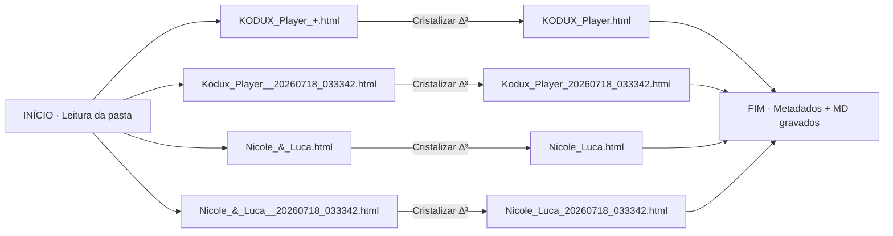

# ✧ 00_RESUMO · Cristalização ∆³
**Pasta**: `./3_ESPIRITO/2_AZURE/1_ARQUIVOS/1_HTML`  
**Data**: 2026-07-18T03:36:44.831186  
**Arquivos processados**: 4

## 🧭 Fluxograma da Operação


## 🌳 Árvore da Pasta (após)
```
./3_ESPIRITO/2_AZURE/1_ARQUIVOS/1_HTML
├── 00_METADADOS.json
├── 00_RESUMO.md
├── Arquetipo_Reader.html
├── DUAL_FUSION_SYSTEM.html
├── EM_NOME_DO.html
├── HORUS_DASH.html
├── KOBLLUX.html
├── KOBLLUX_Interface.html
├── KOBLLUX_TRINITY.html
├── KODUX_Player_1.html
├── KODUX_Player_2.html
├── KODUX_Player_20260718_024450.html
├── KODUX_Player_Widget_KBLX_1134.html
├── Kodux_Player.html
├── Kodux_Player_20260718_023820.html
├── Kodux_Player_20260718_033342.html
├── Kodux_Player_KOBLLUX_v10_1134.html
├── Kodux_Player_KOBLLUX_v10_1134_20260718_023820.html
├── Nicole_Luca.html
├── Nicole_Luca_20260718_033342.html
└── Stream_Oi_Dual.html
```

## 📋 Tabela de Renomeações
| # | Nome ANTES | Nome DEPOIS | Tipo | Hash (SHA-256) |
|---|---|---|---|---|
| 1 | `KODUX_Player_+.html` | `KODUX_Player.html` | `html` | `3e904c213d240153…` |
| 2 | `Kodux_Player__20260718_033342.html` | `Kodux_Player_20260718_033342.html` | `html` | `fa5be97551f30d64…` |
| 3 | `Nicole_&_Luca.html` | `Nicole_Luca.html` | `html` | `a8ab7fcd6fe9bd09…` |
| 4 | `Nicole_&_Luca__20260718_033342.html` | `Nicole_Luca_20260718_033342.html` | `html` | `c6ddb8ec1ef643de…` |

---
∆³ ∴ 3×6×9×7 = 1134 · Nomes cristalizados e selados