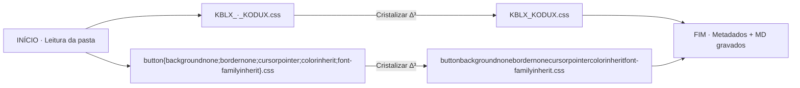

# ✧ 00_RESUMO · Cristalização ∆³
**Pasta**: `./3_ESPIRITO/2_AZURE/1_ARQUIVOS/2_BODY`  
**Data**: 2026-07-18T02:55:28.362560  
**Arquivos processados**: 2

## 🧭 Fluxograma da Operação


## 🌳 Árvore da Pasta (após)
```
./3_ESPIRITO/2_AZURE/1_ARQUIVOS/2_BODY
├── 00_METADADOS.json
├── KBLX_KODUX.css
└── buttonbackgroundnonebordernonecursorpointercolorinheritfont-familyinherit.css
```

## 📋 Tabela de Renomeações
| # | Nome ANTES | Nome DEPOIS | Tipo | Hash (SHA-256) |
|---|---|---|---|---|
| 1 | `KBLX_·_KODUX.css` | `KBLX_KODUX.css` | `css` | `8434739ce4e44162…` |
| 2 | `button{backgroundnone;bordernone;cursorpointer;colorinherit;font-familyinherit}.css` | `buttonbackgroundnonebordernonecursorpointercolorinheritfont-familyinherit.css` | `css` | `6e578437aae49fb8…` |

---
∆³ ∴ 3×6×9×7 = 1134 · Nomes cristalizados e selados