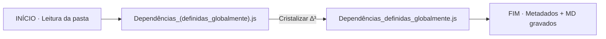

# ✧ 00_RESUMO · Cristalização ∆³
**Pasta**: `./3_ESPIRITO/2_AZURE/1_ARQUIVOS/3_SCRIPTS`  
**Data**: 2026-07-18T03:36:44.848241  
**Arquivos processados**: 1

## 🧭 Fluxograma da Operação


## 🌳 Árvore da Pasta (após)
```
./3_ESPIRITO/2_AZURE/1_ARQUIVOS/3_SCRIPTS
├── 00_METADADOS.json
├── 00_RESUMO.md
├── CADIAL_ARQUETIPOS.js
├── Dependências_definidas_globalmente.js
├── Dependências_definidas_globalmente_1.js
├── HORUS.js
├── KOBLLUX_CADIAL_ARQUÉTIPOS_PRELOADED_COMPATÍVEL_COM_KODUX_PLAYER_V3.js
├── Player-insert.js
├── Player_Database.js
├── Registry.js
├── arquivo_sem_nome.js
├── sem_titulo.js
├── sem_titulo_20260718_023820.js
└── windowKODUX.js
```

## 📋 Tabela de Renomeações
| # | Nome ANTES | Nome DEPOIS | Tipo | Hash (SHA-256) |
|---|---|---|---|---|
| 1 | `Dependências_(definidas_globalmente).js` | `Dependências_definidas_globalmente.js` | `js` | `e0b4ad2f5c621169…` |

---
∆³ ∴ 3×6×9×7 = 1134 · Nomes cristalizados e selados