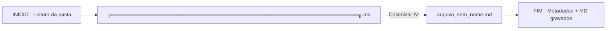

# ✧ 00_RESUMO · Cristalização ∆³
**Pasta**: `./3_ESPIRITO/2_AZURE/2_DOCUMENTOS/3_MD`  
**Data**: 2026-07-18T03:36:44.889362  
**Arquivos processados**: 1

## 🧭 Fluxograma da Operação


## 🌳 Árvore da Pasta (após)
```
./3_ESPIRITO/2_AZURE/2_DOCUMENTOS/3_MD
├── 00_METADADOS.json
├── 00_RESUMO.md
├── Ação_O.md
├── KBLX.md
├── KBLX_horus_ONLINE.md
├── KOBLLUX_TODAS.md
├── KOBLLUX_TODAS_20260718_024451.md
├── Trilhas_Mano_eu_vou_ver_aqui_o_que_que_você_fez_se_deu_deu_certo_E_a_ideia_da.md
└── arquivo_sem_nome.md
```

## 📋 Tabela de Renomeações
| # | Nome ANTES | Nome DEPOIS | Tipo | Hash (SHA-256) |
|---|---|---|---|---|
| 1 | `╔══════════════════════════════════════════════════════════════════╗.md` | `arquivo_sem_nome.md` | `md` | `a993ee4b284fdb00…` |

---
∆³ ∴ 3×6×9×7 = 1134 · Nomes cristalizados e selados