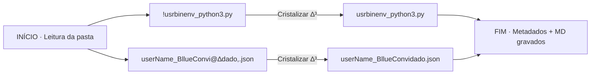

# ✧ 00_RESUMO · Cristalização ∆³
**Pasta**: `./3_ESPIRITO/2_AZURE/3_CODIGOS`  
**Data**: 2026-07-18T03:36:44.905934  
**Arquivos processados**: 2

## 🧭 Fluxograma da Operação


## 🌳 Árvore da Pasta (após)
```
./3_ESPIRITO/2_AZURE/3_CODIGOS
├── 00_METADADOS.json
├── 00_RESUMO.md
├── Componente_1_fusion-card.py
├── Write_the_exact.py
├── horus-injetar-header.sh
├── userName_BllueConvidado.json
└── usrbinenv_python3.py
```

## 📋 Tabela de Renomeações
| # | Nome ANTES | Nome DEPOIS | Tipo | Hash (SHA-256) |
|---|---|---|---|---|
| 1 | `!usrbinenv_python3.py` | `usrbinenv_python3.py` | `py` | `bad8125a86e1ae20…` |
| 2 | `userName_BllueConvi@∆dado,.json` | `userName_BllueConvidado.json` | `json` | `87e9d1cb95683fde…` |

---
∆³ ∴ 3×6×9×7 = 1134 · Nomes cristalizados e selados